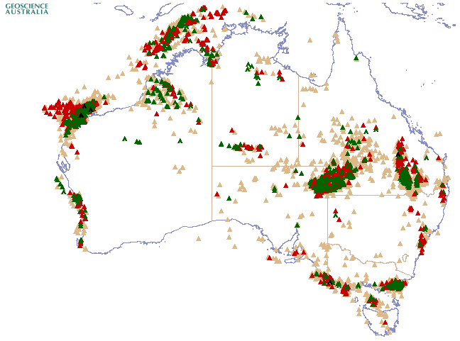

=====================================
Geochemical Exploratory Data Analysis
=====================================

Exploratory Data Analysis of Rock Eval. Geochemical data from Australlia
*© Commonwealth of Australia (Geoscience Australia) 2017.*

Getting Started
---------------

Read the `report <>`_.

Getting the data
----------------

Geoscience Australlia `Petroleum Wells <http://dbforms.ga.gov.au/www/npm.well.search>`_ provides open access to the borehole well data.

The dataset is hosted under a creative commons `Attribution 3.0 Australia (CC BY 3.0 AU) <https://creativecommons.org/licenses/by/3.0/au/deed.en>`_

View the `copyright and disclaimer <http://www.ga.gov.au/copyright>`_ notice for information before downloading.

The process can not be automated as there is only a limited api to the website. You will need to select a range of wells, check the "Organic Geochemistry"
and then click "Submit Query". The results can be saved as a csv. It may be neccesary to copy all of the information from the resulting web page
to a text file to create the csv.

The figure shows all wells with hydrocarbon shows in Geoscience Australia's data set.

Figure © Commonwealth of Australia (Geoscience Australia) 2017

Overview of dataset
-------------------

A description of each column header can be found `here <http://www.ga.gov.au/petroliumwells-report/help_csv.jsp>`_.

